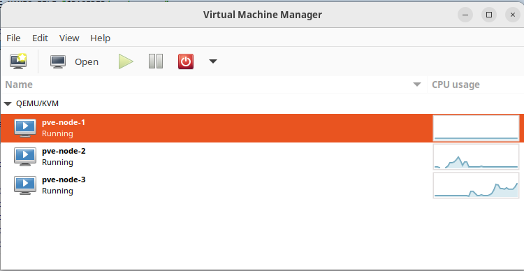
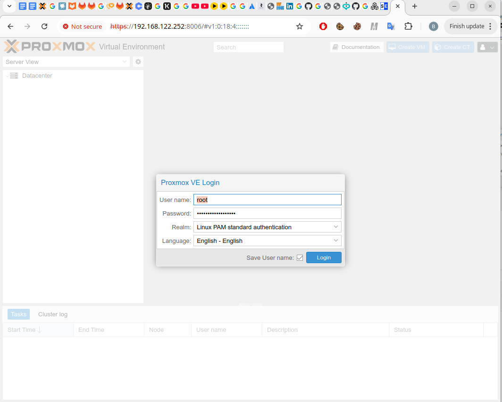
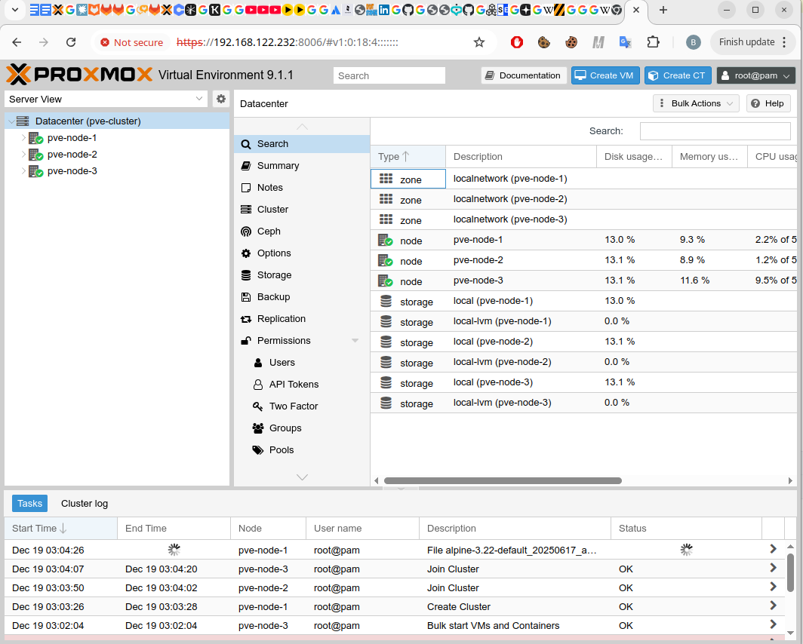
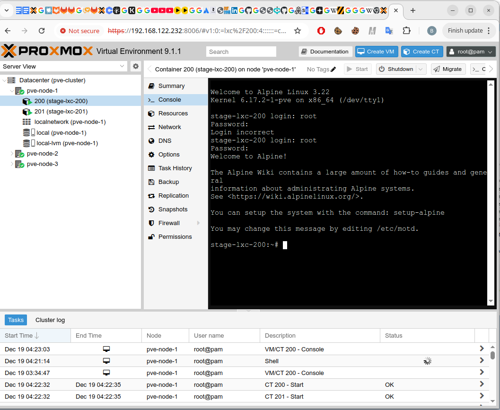
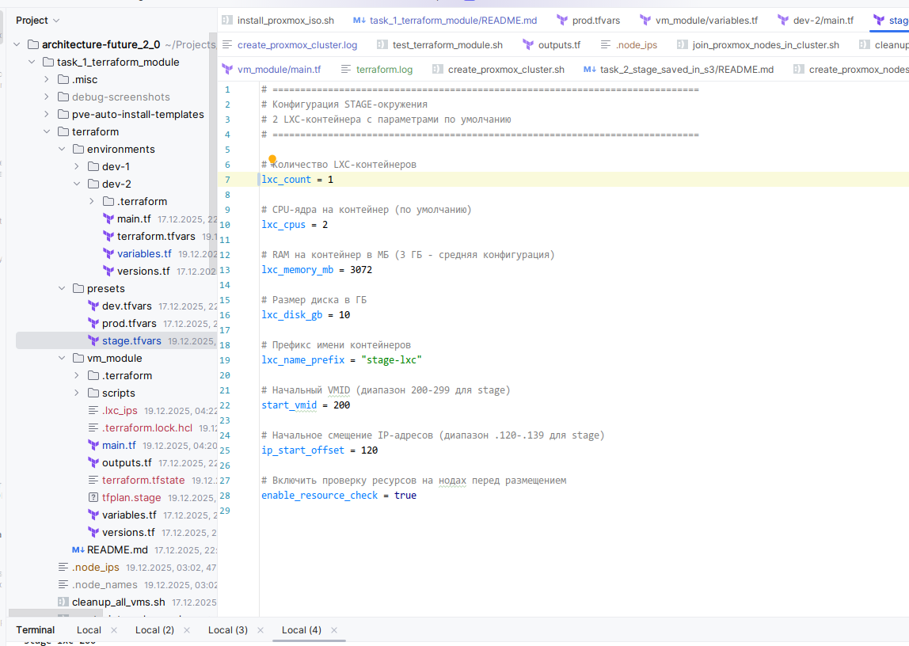
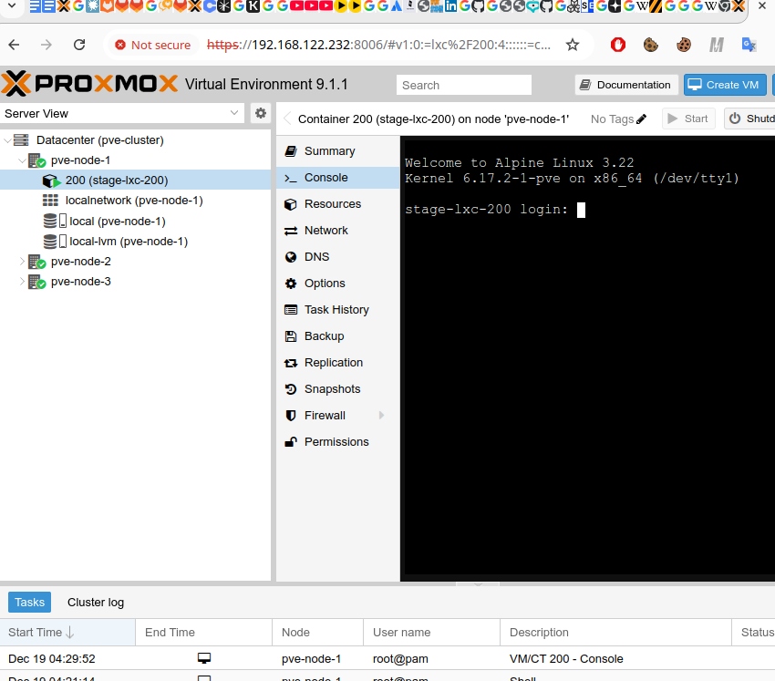

# Задание 1. Модульная инфраструктура для нескольких сред

Здесь, чтобы лучше понять, как работает terraform, я не пошёл сразу в Yandex Cloud, а решил сперва сделать пародию на нарезку виртуалок на пуле bare metal-серверов для частного облака через Terraform. 

Прототип делал с помощью Claude Opus 4.5 (благо в Windsurf как раз акция) -- но сгенерированное честно читал (и даже принцип действия вроде понял).
Тестировал на Ubuntu 24.04, 128 Gb DDR4, Ryzen 3700X, но должно работать и на меньшем объёме памяти.

Стало быть, мы создадим на локальном хосту несколько KVM-виртуалок (они будут изображать из себя bare-metal-сервера в ЦОДе), а затем поставим на них Proxmox -- и уже с его помощью будем нарезать на них внутренние LXC-вирутуалки. На эти LXC-виртуалки потом можно поставить и кубер, но его я здесь пока не ставил.

## Основные файлы для задания

### Скрипты управления инфраструктурой
* `cleanup_all_vms.sh` -- удалить все "внешние" KVM-виртуалки вместе с их дисками;
* `delete_internal_vms.sh` -- удалить внутренние LXC-контейнеры (созданные Terraform'ом) без удаления внешних KVM-виртуалок;
* `generate_ssh_keys.sh` -- сгенерировать приватный и публичный ключ для доступа на внутренние LXC-виртуалки;
* `create_proxmox_cluster.sh` -- создать 3 KVM-виртуалки и собрать из них минималистичный Proxmox-кластер;

### Структура папки `terraform/`
* `vm_module/` -- основной Terraform-модуль для создания LXC-контейнеров:
  * `main.tf` -- главный файл с ресурсами (контейнеры, шаблоны, provisioner'ы);
  * `variables.tf` -- входные переменные модуля (количество CPU, RAM, диск, сеть и т.д.);
  * `outputs.tf` -- выходные переменные (IP-адреса, VMID созданных контейнеров);
  * `versions.tf` -- версии провайдеров (Proxmox, null, local);
* `presets/` -- готовые tfvars-файлы с параметрами для разных окружений:
  * `stage.tfvars` -- настройки для stage-окружения (2 контейнера по 2 vCPU);
  * `dev.tfvars` -- настройки для dev-окружения;
  * `prod.tfvars` -- настройки для prod-окружения;

## Как протестировать

0) Включаем виртуализацию в BIOS, если ещё не включили.
1) Генерируем SSH-ключи для LXC-виртуалок:
```bash
bash generate_ssh_keys.sh
```

2) Ставим KVM + QEMU + libvirt
```bash
sudo apt update
sudo apt install -y qemu-kvm libvirt-daemon-system libvirt-clients bridge-utils virt-manager
sudo usermod -aG kvm,libvirt $USER  # разрешаем юзеру использовать libvirt без sudo
newgrp libvirt
sudo systemctl status libvirtd  # Проверяем, что включено
```

3) Запускаем `virt-manager` для проверки, что "внешние" виртуалки для Proxmox создаются:

_Перед стартом в `virt-manager` должно быть пусто!_
---

4) Запускаем скрипт создания "внешнего кластера":
```bash
bash create_proxmox_cluster.sh
```

Это может занять некоторое время (около 15 минут), потому что ноды у меня стартуют последовательно, и на них на всех ставится специальный Debian для Proxmox. Но это надо сделать один раз, больше не придётся, так что оптимизацией я не морочился = )

В консольку будет печататься всякое, а в `virt-manager` будут появляться новые ноды, числом до 3:

_Первая KVM-виртуалка стартует..._


_А там и вторая и третья потихоньку подтянутся..._

Логи выглядят [примерно так.](create_proxmox_cluster.log)

Если скрипт отработал нормально, то создадутся 2 дополнительных файла: `.node_ips` и `.node_names`

5) Открываем `.node_ips` -- там будут IP-адреса наших "внешних" виртуалок, примерно такие:
```
192.168.122.252
192.168.122.114
192.168.122.210
```

6) Заходим на одну из виртуалок по порту 8006 в веб-интерфейс Proxmox: http://ip-первой-виртуалки:8006


7) И логинимся под логином `root` и паролем `mega_root_password`


_Проверяем: в нашем "дата-центре" должно быть 3 ноды!_


8) Теперь запускаем наш terraform-модуль, чтобы он насоздавал нам виртуалок:
```bash
cd terraform/vm_module
terraform init
terraform terraform plan -var-file="../presets/stage.tfvars" -out=tfplan.stage  # будем создавать stage-окружение с 2 виртуалками по 2 vCPU
terraform apply tfplan.stage
```

Вывод в консоли должен выглядеть [примерно так.](terraform.log)

9) Потом идём обратно в наш веб-интерфейс Proxmox -- в одной из "внешних" виртуалок должны появиться 2 внутренние LXC-виртуалки:


10) Ну и немного модифицируем нашу конфигурацию: откроем `teraform/presets/stage.tfvars` -- и выставим там 1 виртуалку вместо 2:


И снова сделаем
```bash
terraform terraform plan -var-file="../presets/stage.tfvars" -out=tfplan.stage  # будем создавать stage-окружение с 2 виртуалками по 2 vCPU
terraform apply tfplan.stage
```

Нам покажут вот такой красивый вывод:
```
➜  vm_module git:(terraform) ✗ terraform apply tfplan.stage                                        
local_file.lxc_ips[0]: Destroying... [id=9bd1d7534ed97557b1a732167da204beb9eac34a]
local_file.lxc_ips[0]: Destruction complete after 0s
null_resource.setup_ssh[1]: Destroying... [id=2834745422522236558]
null_resource.setup_ssh[1]: Destruction complete after 0s
proxmox_virtual_environment_container.lxc[1]: Destroying... [id=201]
proxmox_virtual_environment_container.lxc[0]: Modifying... [id=200]
proxmox_virtual_environment_container.lxc[1]: Destruction complete after 5s
proxmox_virtual_environment_container.lxc[0]: Modifications complete after 6s [id=200]
local_file.lxc_ips[0]: Creating...
local_file.lxc_ips[0]: Creation complete after 0s [id=cfae81007009cd0583f66ca606047e4f69e1e3cc]

Apply complete! Resources: 1 added, 1 changed, 3 destroyed.
```

И LXC-виртуалка останется только одна:


11) А пока сделаем:
```bash 
terraform plan -destroy -out tfplan.destroy
terraform apply tfplan.destroy
```

Должны показать:
```bash
local_file.lxc_ips[0]: Destroying... [id=cfae81007009cd0583f66ca606047e4f69e1e3cc]
local_file.lxc_ips[0]: Destruction complete after 0s
null_resource.setup_ssh[0]: Destroying... [id=7811707473291311185]
null_resource.setup_ssh[0]: Destruction complete after 0s
proxmox_virtual_environment_container.lxc[0]: Destroying... [id=200]
proxmox_virtual_environment_container.lxc[0]: Destruction complete after 6s
proxmox_virtual_environment_download_file.lxc_template[0]: Destroying... [id=local:vztmpl/alpine-3.22-default_20250617_amd64.tar.xz]
proxmox_virtual_environment_download_file.lxc_template[0]: Destruction complete after 0
```

И последняя LXC-виртуалка должна исчезнуть совсем.

А в следующей части будем возиться с GitOps и S3-хранилищем = )