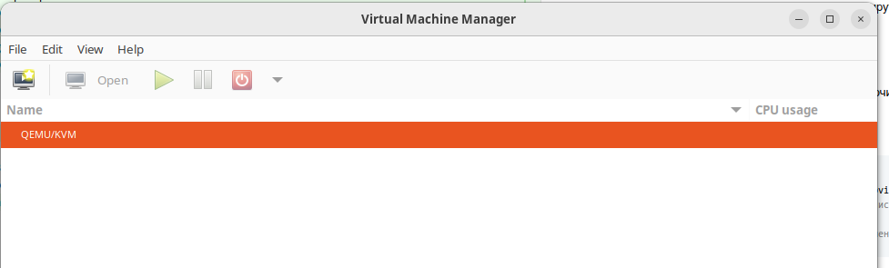
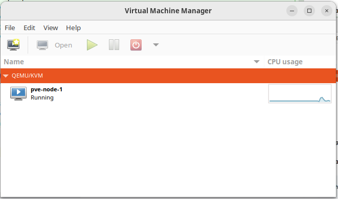

# Задание 1. Модульная инфраструктура для нескольких сред

Здесь, чтобы лучше понять, как работает terraform, я не пошёл сразу в Yandex Cloud, а решил сперва сделать пародию на нарезку виртуалок на пуле bare metal-серверов для частного облака через Terraform. 

Прототип делал с помощью Claude Opus 4.5 (благо в Windsurf как раз акция) -- но потом честно читал и принцип действия вроде понял.
Тестировал на Ubuntu 24.04, 128 Gb DDR4, Ryzen 3700X, но должно работать и на меньшем объёме памяти.

Стало быть, мы создадим на локальном хосту несколько KVM-виртуалок (они будут изображать из себя bare-metal-сервера в ЦОДе), а затем поставим на них Proxmox -- и уже с его помощью будем нарезать на них внутренние LXC-вирутуалки. На эти LXC-виртуалки, потом можно поставить и кубер, но его я здесь пока не ставил.

## Структура проекта
* `cleanup_all_vms.sh` -- удалить все "внешние" KVM-виртуалки вместе с их дисками;
* `generate_ssh_keys.sh` -- сгенерировать приватный и публичный ключ для доступа на внутренние LXC-виртуалки;
* `create_proxmox_cluster.sh` -- создать 3 KVM-виртуалки и собрать из них минималистичный Proxmox-кластер;
* ``


Чтобы это протестировать, надо сделать следующее:

0) Включаем виртуализацию в BIOS, если ещё не включили.
1) Генерируем SSH-ключи для LXC-виртуалок:
``````
2) Ставим KVM + QEMU + libvirt
```bash
sudo apt update
sudo apt install -y qemu-kvm libvirt-daemon-system libvirt-clients bridge-utils virt-manager
sudo usermod -aG kvm,libvirt $USER  # разрешаем юзеру использовать libvirt без sudo
newgrp libvirt
sudo systemctl status libvirtd  # Проверяем, что включено
```

3) Запускаем `virt-manager` для проверки, что "внешние" виртуалки для Proxmox создаются:

_Пока в virt-manager пусто..._

4) Запускаем скрипт создания "внешнего кластера":
```bash
bash create_proxmox_cluster.sh
```

Это может занять некоторое время (около 15 минут), потому что ноды у меня стартуют последовательно, и на них на всех ставится специальный Debian для Proxmox. Но это надо сделать один раз, больше не придётся, так что оптимизацией я не морочился = )

В консольку будет печататься всякое, а в `virt-manager` будут появляться новые ноды, числом до 3:

_Первая нода стартует..._
