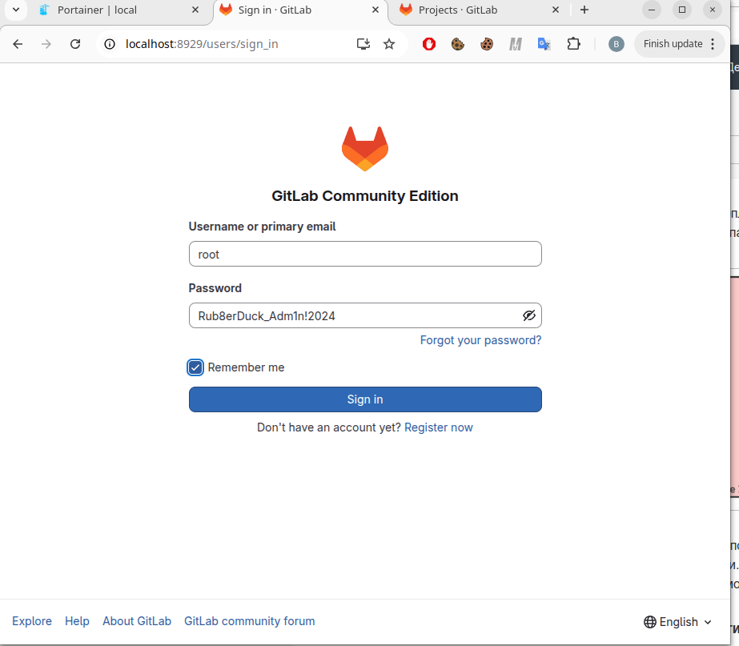
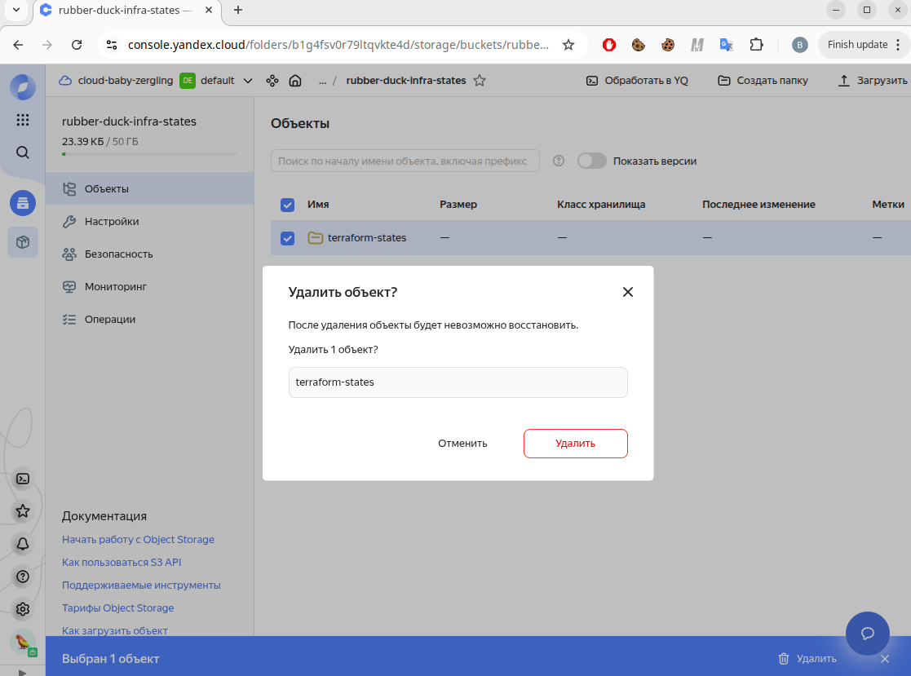
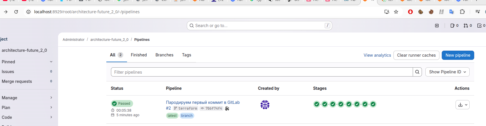
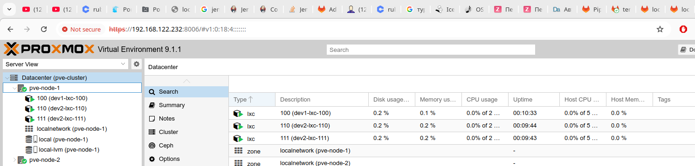
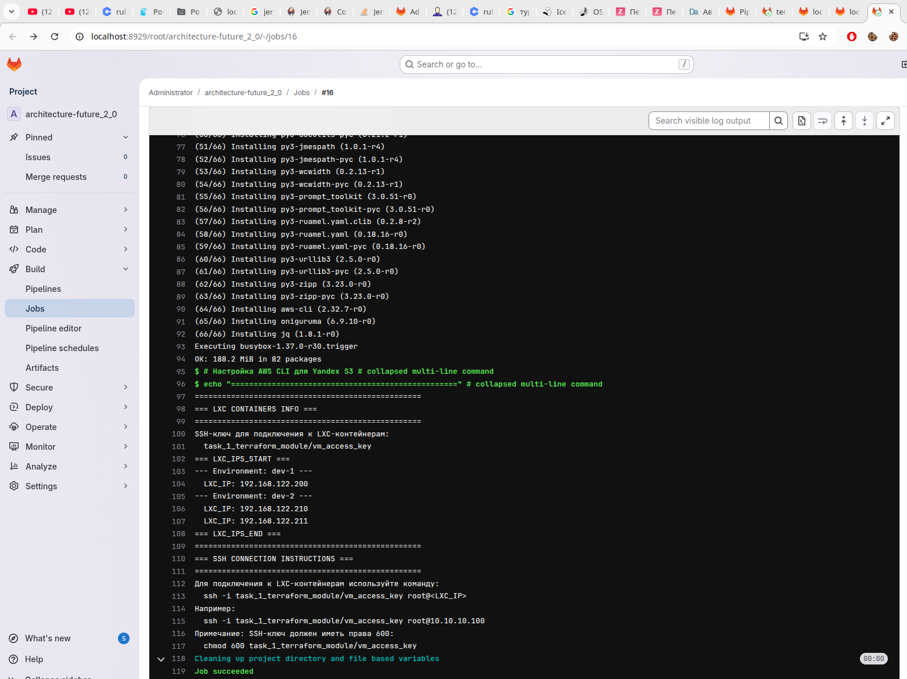
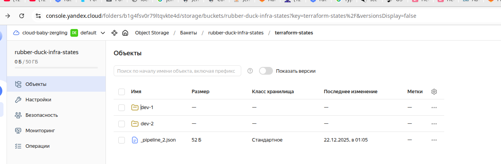
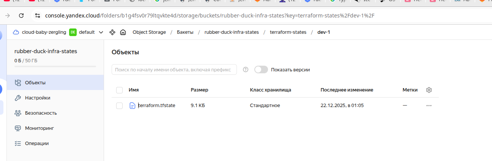
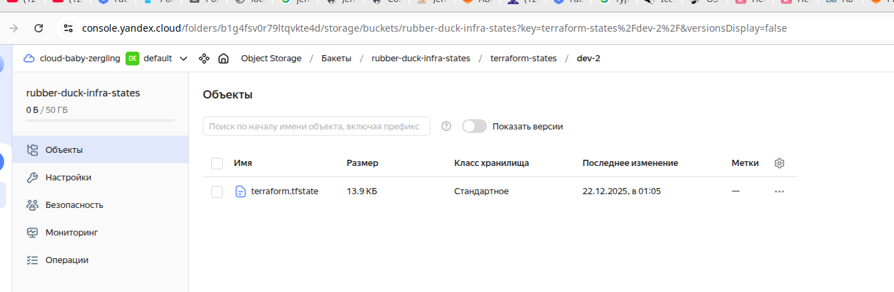
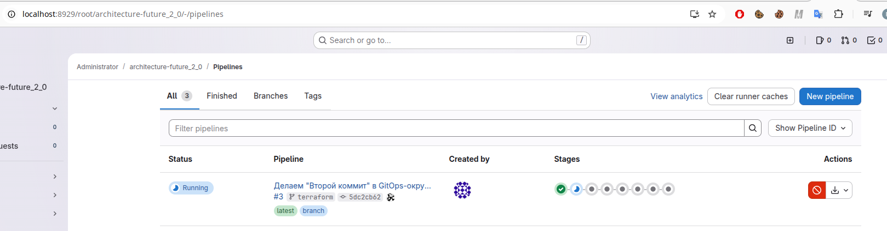
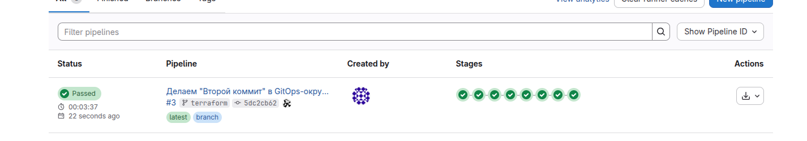

# Задание 2. Интеграция с CI/CD и удалённым хранением состояния


В этом задании мы запустим GitLab в docker-compose и настроим CI/CD pipeline, который:
- Скачивает Terraform state из S3
- Выполняет `terraform plan` и `terraform apply`
- Загружает обновлённый state обратно в S3
- Проверяет соответствие state реальной инфраструктуре в Proxmox

Наши декларативные описания инфраструктуры для этого задания  `task_2_stage_saved_in_s3/terraform/environments`, и мы оттуда будем обращаться к Terraform-модулю из `task_1_terraform_module`

Состояние будем хранить в S3-бакете `rubber-duck-infra-states` на Yandex Object Storage.

## Основные файлы

### Конфигурация и запуск GitLab
* `docker-compose.yaml` -- docker-compose для запуска GitLab и GitLab Runner;
* `.env` -- переменные окружения (S3-credentials, GitLab-пароли);
* `init-gitlab.sh` -- скрипт инициализации GitLab (создание проекта, регистрация runner'а);
* `gitlab-init/entrypoint.sh` -- entrypoint для контейнера инициализации;

### Тестовые скрипты
* `test_gitlab.sh` -- тест запуска GitLab и базовой функциональности;
* `test_pipeline.sh` -- тест CI/CD pipeline с Terraform;
* `test_terraform_action.sh` -- тест Terraform action с S3-хранилищем;

### Вспомогательные скрипты
* `switch-to-gitlab.sh` -- переключить git remote на локальный GitLab;
* `switch-to-github.sh` -- переключить git remote обратно на GitHub;
* `scripts/verify_state.sh` -- скрипт проверки Terraform state из S3 и соответствия с Proxmox;

### Декларативные описания:
* `terraform/environments/` -- конфигурации окружений (`dev-1`, `dev-2`), использующие `vm_module` из задания 1;

## Как протестировать?
1) Запускаем наш GitLab (он может стартовать небыстро!)

```bash
docker compose up -d
```

2) Заходим в GitLab на http://localhost:8929/


_Тестовые креды: юзер `root`, пароль `Rub8erDuck_Adm1n!2024`_
---

3) Запускаем дополнительную инициализацию GitLab, чтобы туда добавился наш проект:
```bash
bash init_gitlab.sh
```

Примеры вывода этого скрипта -- в [`init_gitlab.log`](init_gitlab.log)

Должен создаться файл `.gitlab_token` в текущей директории.

3) Заходим в наш S3-бакет -- и удаляем старые состояния:


4) Добавляем какой-нибудь коммент в [`terraform/environments/dev-1`](terraform/environments/dev-1), чтобы коммит был не пустой...


5) И делаем `commit` и `push` в наш GitLab, в ветку `terraform` (наш пайплайн настроен на неё).

```bash
bash switch-to-gitlab.sh
git add terraform/environments/dev-1/main.tf
git commit -m "Пародируем первый коммит в GitLab"
git push gitlab terraform 
```

6) После того заходим в http://localhost:8929/root/architecture-future_2_0/-/pipelines и смотрим наш мега-пайплайн:



7) Заходим в Proxmox Web UI и смотрим, появились ли наши виртуалки:

_Таки да, появились, 1 для dev-1, 2 для dev-2_

Заходим в `show_lxc_info` и смотрим, как подключаться к нашим новосозданным LXC-виртуалкам:


Делаем
```bash
# Хинт: -o "StrictHostKeyChecking no" нужно, чтобы не падать на ошибке типа "fingerprint changed" 
ssh -o "StrictHostKeyChecking no" -i ../task_1_terraform_module/vm_access_key root@Вставить_тот_IP_который_покажут
```

Должна показаться root-консоль от нашей LXC-виртуалки:
```
➜  ssh -o "StrictHostKeyChecking no" -i ../task_1_terraform_module/vm_access_key root@192.168.122.200
@@@@@@@@@@@@@@@@@@@@@@@@@@@@@@@@@@@@@@@@@@@@@@@@@@@@@@@@@@@
@    WARNING: REMOTE HOST IDENTIFICATION HAS CHANGED!     @
@@@@@@@@@@@@@@@@@@@@@@@@@@@@@@@@@@@@@@@@@@@@@@@@@@@@@@@@@@@
IT IS POSSIBLE THAT SOMEONE IS DOING SOMETHING NASTY!
Someone could be eavesdropping on you right now (man-in-the-middle attack)!
It is also possible that a host key has just been changed.
The fingerprint for the ED25519 key sent by the remote host is
SHA256:9hVXX/qehBo5J1uNznuKH2xn4CVmbo7IElXMH6xyc+E.
Please contact your system administrator.
Add correct host key in /home/felix/.ssh/known_hosts to get rid of this message.
Offending ED25519 key in /home/felix/.ssh/known_hosts:42
  remove with:
  ssh-keygen -f '/home/felix/.ssh/known_hosts' -R '192.168.122.200'
Password authentication is disabled to avoid man-in-the-middle attacks.
Keyboard-interactive authentication is disabled to avoid man-in-the-middle attacks.
UpdateHostkeys is disabled because the host key is not trusted.
Welcome to Alpine!

The Alpine Wiki contains a large amount of how-to guides and general
information about administrating Alpine systems.
See <https://wiki.alpinelinux.org/>.

You can setup the system with the command: setup-alpine

You may change this message by editing /etc/motd.

dev1-lxc-100:~# 
```

[NB: Некоторые логи от пайплайна я на всякий случай сохранил тут.](pipeline_logs/1) 

8) Далее идём в наш S3-бакет на Yandex Object Storage: там появятся наши первые terraform-состояния.




9) А теперь пусть в конфигурации `dev-2` будет не 2, а 3 виртуалки: зайдём в `task_1_terraform_module/terraform/environments/dev-2/terraform.tfvars` и выставим там:
```terraform
# Количество LXC-контейнеров
lxc_count = 3
```
9) Закоммитим изменения и сделаем `push gitlab terraform` 

10) Снова идём в Gitlab на  http://localhost:8929/root/architecture-future_2_0/-/pipelines и отыскиваем там новый запуск нашего мега-пайплайна.


_Смиренно ждём, пока оный запуск завершится..._


_Дождались, можно читать логи..._

На стадии `terraform_apply` в логах должны быть примерно такие строки:
```
==========================================
=== Processing dev-1 ===
==========================================
--- Step 1: Download existing state from S3 ---
2025-12-21 22:05:34       9317 terraform.tfstate
Found existing state in S3, downloading...
download: s3://rubber-duck-infra-states/terraform-states/dev-1/terraform.tfstate to ./terraform.tfstate
State downloaded. Resources in state:
```
...
```
==========================================
=== Processing dev-2 ===
==========================================
--- Step 1: Download existing state from S3 ---
2025-12-21 22:05:36      14236 terraform.tfstate
Found existing state in S3, downloading...
download: s3://rubber-duck-infra-states/terraform-states/dev-2/terraform.tfstate to ./terraform.tfstate
State downloaded. Resources in state:
  - local_file.lxc_ips
  - null_resource.setup_ssh
  - proxmox_virtual_environment_container.lxc
  - proxmox_virtual_environment_download_file.lxc_template
```


[//]: # (4&#41; Запускаем скрипт для  пайплайна:)

[//]: # (```bash)

[//]: # (bash test_pipeline.sh)

[//]: # (```)