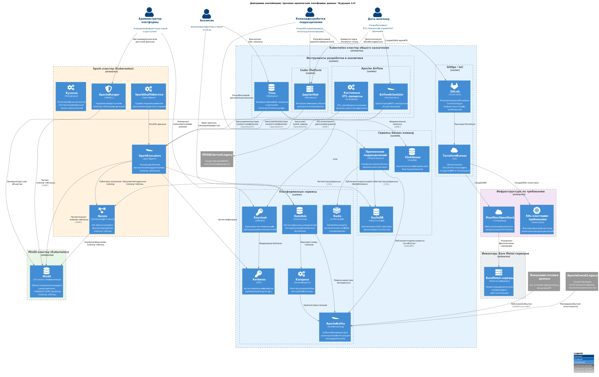

# Задание 3. Проектирование целевой архитектуры и оценка рисков внедрения

## Задача 1. Целевая архитектура системы

### Какие у нас главные вызовы?

* Появятся новые подразделения.  
  * С одной стороны, сотрудники должны пользоваться всеми благами централизации: использовать данные, которые собирают другие подразделения и пользоваться централизованными сервисами тоже должны.  
  * С другой стороны, это не должно стать их тормозом (чем меньше заявок и согласований – тем лучше).  
  * С третьей стороны – нужен хоть какой-то контроль доступа к данным.  
* Объём данных будет увеличиваться (ожидаем рост до нескольких петабайт за 3 года).  
* Может понадобится собирать большие объёмы данных в реальном времени (с медицинской электроники). И обрабатывать их.  
* Может понадобиться разворачивать копии сервисов с локальным хранением персональных данных (если я всё правильно понял, и выход на 2-3 новых региона означал именно открытие филиалов за границей : 3

### Какие проблемы у текущей архитектуры?

#### Что не так с MS SQL Server?

*> Объём данных измеряется сотнями терабайт, а сценариев их использования — невероятное множество, что приводит к большому количеству трансформаций. В результате замедляется time-to-market и падает производительность аналитических процессов: формирование сложных отчётов может занимать часы.*

Подозреваю здесь 2 антипаттерна.

* Судя по объёмам, MS SQL Server здесь используют не только для структурированных данных, но и вместо объектного хранилища (например, для хранения медицинских снимков).  
* Судя по формулировке “приводит к большому количеству трансформаций”, многие аналитические сервисы работают напрямую с исходными данными, как они есть. Почему так? Два варианта:  
  * удобных аналитических витрин под популярные запросы аналитики здесь нет совсем или недостаточно,  
  * или разработчики аналитики об этих витринах не знают.

Специального объектного хранилища, чтобы вынести в него неструктурированые данные из MS SQL Server – не наблюдается.

Специальных БД для аналитических витрин в системе тоже не видно. Можно насоздавать витрин в той же MS SQL Server (там тоже появилось колоночное хранение данных для OLAP) – но это явно придётся расширять кластер БД. И тут мы упираемся в стоимость хранения данных в MS SQL Server.

##### Стоимость хранения данных в MS SQL Server

MS SQL Server – это всегда дорого. В разы дороже, чем для ClickHouse или связка S3 + Iceberg + Spark. В основном – из-за дорогих лицензий.

Пара ссылок, чтобы проникнуться.

* [Цены на лицензии](https://www.microsoft.com/en-us/sql-server/sql-server-2022-pricing): $15,123 за 2-core pack за лицензию типа Enterprise – это гроб-гроб-кладбище для дальнейшего масштабирования;  
* [Сравнение типов лицензий](https://learn.microsoft.com/en-us/sql/sql-server/editions-and-components-of-sql-server-2022?view=sql-server-ver17#scale-limits): а тут рассказывают, почему нам нужен именно Enterprise (потому что кэш данных в 128 гигов нам уже маловат).

Подробнее – распишем в задании 5.

#### Что не так с Apache Camel?

* Apache Camel работает по принципу “умная труба + глупый потребитель”.  
  * Чтобы зарегистрироваться нового производителя – нужно править настройки на стороне Apache Camel.  
  * Чтобы добавить отправку данных новому потребителю – нужно опять-таки править настройки на стороне Apache Camel.  
  * Отсюда лишняя нагрузка на девопсов и хуже скорость разработки (т.к. теряем время на согласования).  
* Производительность у Apache Camel, даже если он работает через Kafka, всё равно хуже, чем у просто Kafka:  
  * он не просто перебрасывает сообщения, а читает их, проверяет и конвертирует в собственную объектную модель (Exchange-объект);  
  * он может масштабироваться, но у Kafka состояние локально для каждого экземпляра, а у Camel используется общая база для хранения состояния.

**Даже если производительности нам пока хватает, то мы всё равно упираемся в необходимость централизованной настройки Camel при любых изменеиях, а мы в этом спринте жёстко топим за максимальное самообслуживание.**

### Какой должна быть целевая архитектура?

#### Принцип Data Lakehouse + вспомогательные БД

Для снижения стоимости данных – перестаём хранить всё и вся в одной базе. Тем более, в MS SQL Server.

* Используем MinIO как объектное хранилище для сырых данных (в т.ч. неструктурированных).  
  * а также в качестве низкоуровневого хранилища для Iceberg-таблиц (как каталоги в S3 c PARQUET/ORC-файлами);  
* Используем Iceberg в качестве табличного движка и надстройки над S3.  
* Используем Nessie в качестве каталога данных.  
* Используем Spark в качестве основного средства распределённых вычислений над данными.

Так мы получим и хорошие возможности по масштабированию, и умеренную стоимость хранения данных.

Если надо, не брезгуем добавить и вспомогательные БД. Например, ClickHouse для аналитических витрин или Cassandra/ScyllaDB или Redis для онлайн-данных.

#### Data Mesh + принцип самообслуживания

Для гибкости – будем учиться в self-service и Data Mesh (чтобы при подключении новых подразделений или новых источников данных не нужно было перестраивать системы целиком). В нашем случае это выглядит так.

* Есть центральная платформа и её команда (предоставляет инфраструктуру мощную и инструменты богатые).  
* И есть команды бизнес-направлений, которые как можно больше задач выполняют самостоятельно, не обращаясь к команде разработке платформы (а только к их сервисам.  
* Владение данными – на уровне бизнес-команд.  
* Обращение к данным других команд – допустимо и приветствуется, однако доступ к данным контролируется (т.е. нужен удобный механизм работы с заявками на доступ – и контроля доступа).  
* Нужны единые стандарты по качеству данных и их документированию (и технические средства для их контроля, и организационные меры).  
  * Свои дополнительные стандарты внутри бизнес-команд тоже могут быть, но общие стандарты – в обязательном порядке.

#### Принцип EDA – по возможности

В некоторых случаях нам нужна обработка событий в реальном времени (например, чтобы на производстве электроники сразу узнали, что их закупка химии для выполнения ГОЗ автоматически оплачена банком).

Нам выгодно, чтобы банк мог не знать достоверно, кто потребляет его события, а просто отправлял события об обновлениях по платежам, публиковал метаданные по платежам, а подписаться на них могли в разных подразделениях.  
Но: бывают случаи, когда нужно не скидывать все данные по тематике в один топик, а публиковать их гранулярно. Например, публиковать обновления транзакций по конкретному юрлицу или конкретному счёту в отдельный топик, чтобы подписант видел только те транзакции, которые относятся к нему.

Насколько я знаю, это называется мультитенантной EDA, но реализуется обычно не через Kafka, а через Redis Streams (авторизовать отдельных подписчиков по префиксам ключей там тоже можно). Так что если мы правда хотим EDA, то часть событий придётся писать не только в Kafka, но и в Redis Streams для гранулярного доступа.

Сроки выполнения заданий у нас отвратительно низки, так что Redis Streams я вживую не щупал, а только мурзилки читал, но нарисовать его на схемах – нарисую.

#### IaC – по возможности

В подразделениях есть свои разработчики. Им для разработческих и продуктовых целей может потребоваться быстро получить виртуалку в нашем контуре или небольшой кубер-кластер в нём же. У них должна быть возможность делать это без долгих согласований с командой платформы данных, при этом не держа своих серверов в каждом подразделении.

## Конкретная реализация

* MinIO-кластер (отдельный kubernetes-кластер).  
* Spark-кластер (отдельный kubernetes-кластер).  
  * Spark Shuffle Service;  
  * Nessie как Git-like каталог для версионирования Iceberg-таблиц;  
  * Apache Ranger как IAM API для Iceberg.  
  * движок политик безопасности kyverno, чтобы банить приложения, запущенные в клиентском режиме, если они явно зависли;  
  * ну и сами Spark-экзекуторы, запускаемые с клиентов.  
* kubernetes-кластер общего назначения.  
  * Общие сервисы:  
    * DataHub с поддержкой Data Access Workflows через DataHub Actions Framework (в качестве каталога данных и движка для запроса доступа к схемам и таблицам).  
    * Kafka + Karapace (в качестве движка для метаданных Kafka)  
    * Redis (для работы с Redis Streams, когда нам понадобится мультитенантная событийная архитектура)  
      * Опционально – самописный плагин метаданных для Redis для DataHub  
      * Опционально – плагин обработки заявок на доступ к префиксам для DataHub Actions Framework.  
      * Опционально – авторизующее прокси для Redis.  
    * Kerberos  
    * Keycloak  
    * Kafka + Karapace (в качестве движка для метаданных Kafka)  
    * Coder-платформа + JupyterHub для быстрого прототипирования.  
    * Trino или аналог в качества веб-движка для SQL-запросов.  
    * Airflow для ETL-процессов по расписанию + кастомные ETL-процессы (Airflow DAGs), запускающие Spark-экзекуторы в клиентском режиме  
    * GitLab + специальный пайплайн c Terraform для развёртывания инфраструктуры-по-требованию.  
  * Сервисы бизнес-команд, включая вспомогательные БД вроде ClickHouse или ScyllaDB. Их могут создавать и бизнес-команды, но они должны быть внесены в общий каталог данных  
    * хинт: создание namespace с квотами + сервисных аккаунтов + политик безопасности – тоже через Gitlab-пайплайн для развёртывания инфры.  
* Небольшой инвентарь серверов с ProxMox/OpenStack для инфраструктуры по требованию  
  * Работает так: заказчики инфры из подразделений коммитят terraform-спецификацию в специальный репозиторий, и специальный Gitlab-пайплайн разворачивает им на этих серверах виртуалку / несколько виртуалок / целый Kubernetes-кластер) для их задач.  
  * Хинт: этот же пайплайн может создавать им отдельный namespace c квотами и сервисные аккануты и на общем kubernetes-кластере ; )
* Инвентарь Bare Metal-серверов — физические серверы, которыми управляет ProxMox/OpenStack.

### Диаграмма контейнеров



*Исходный файл PlantUML: [container_diagram.puml](container_diagram.puml)*

## Задача 2. Карта рисков

### Архитектурные риски

| № | Риск | Вероятность | Влияние | Описание |
|---|------|-------------|---------|----------|
| A1 | **Сложность миграции данных из MS SQL Server** | Высокая | Высокое | Сотни терабайт данных в legacy-системе. Миграция в Iceberg/MinIO требует тщательного планирования ETL-процессов, валидации данных и возможного даунтайма. |
| A2 | **Несовместимость форматов данных** | Средняя | Среднее | Различные подразделения используют разные форматы. При переходе на единый Iceberg-формат возможны потери или искажения данных. |
| A3 | **Увеличение задержек при распределённых запросах** | Средняя | Среднее | Переход от монолитной БД к распределённой архитектуре (Spark + Iceberg) может увеличить латентность для некоторых типов запросов. |
| A4 | **Избыточная сложность мультитенантной EDA** | Средняя | Среднее | Реализация Redis Streams для гранулярного доступа к событиям добавляет архитектурную сложность и требует кастомной разработки. |
| A5 | **Vendor lock-in на новый стек** | Низкая | Среднее | Хотя выбраны open-source решения, специфика Iceberg + Spark + MinIO создаёт зависимость от этого стека. |

### Технологические риски

| № | Риск | Вероятность | Влияние | Описание |
|---|------|-------------|---------|----------|
| T1 | **Недостаток экспертизы в новых технологиях** | Высокая | Высокое | Команды не имеют опыта работы с Iceberg, Spark, MinIO, DataHub. Кривая обучения может затянуть проект. |
| T2 | **Проблемы производительности Spark** | Средняя | Высокое | Неоптимальные Spark-джобы могут потреблять избыточные ресурсы и тормозить аналитику. |
| T3 | **Сложность интеграции компонентов** | Высокая | Среднее | Большое количество компонентов (DataHub, Ranger, Keycloak, Kerberos, Kafka и др.) требует тщательной настройки взаимодействия. |
| T4 | **Нестабильность open-source компонентов** | Средняя | Среднее | Некоторые компоненты (Karapace, DataHub Actions) относительно молоды и могут содержать баги. |
| T5 | **Сложность отладки распределённых систем** | Высокая | Среднее | Диагностика проблем в распределённой среде (Spark, Kafka, K8s) значительно сложнее, чем в монолите. |

### Организационные риски

| № | Риск | Вероятность | Влияние | Описание |
|---|------|-------------|---------|----------|
| O1 | **Сопротивление изменениям** | Высокая | Высокое | Команды привыкли к MS SQL Server и Camel. Переход на self-service модель требует изменения культуры. |
| O2 | **Недостаток ресурсов платформенной команды** | Средняя | Высокое | Платформенная команда может не справиться с потоком запросов при масштабировании. |
| O3 | **Конфликты владения данными** | Средняя | Среднее | При переходе к Data Mesh возможны споры о том, кто владеет какими данными и кто отвечает за их качество. |
| O4 | **Параллельная поддержка legacy и новой системы** | Высокая | Среднее | В переходный период придётся поддерживать обе системы, что увеличивает нагрузку на команды. |
| O5 | **Несогласованность стандартов между подразделениями** | Средняя | Среднее | Новые подразделения (фарма, электроника) могут иметь свои стандарты работы с данными. |

### Матрица рисков (визуализация)

```
Влияние ↑
         │
 Высокое │  A1, T1, O1    T2, O2
         │
 Среднее │  A5            A2, A3, A4, T3, T4, T5, O3, O4, O5
         │
 Низкое  │
         └──────────────────────────────────────────────────→
              Низкая      Средняя      Высокая      Вероятность
```

## Задача 3. План рисков

> Предложите план управления рисками, описав конкретные меры по их снижению. Укажите, какие риски можно минимизировать с помощью технических решений, а какие — управленческими подходами.

### Технические меры снижения рисков

#### Риск A1: Сложность миграции данных
- **Стратегия постепенной миграции**: начать с менее критичных данных (архивы, аналитика), постепенно переходя к операционным данным.
- **Dual-write период**: новые данные пишутся в обе системы, что позволяет откатиться при проблемах.
- **Автоматизированные проверки качества**: использовать Great Expectations или dbt tests для валидации мигрированных данных.
- **Инструменты сравнения**: скрипты сравнения результатов запросов в старой и новой системе.

#### Риск A2: Несовместимость форматов данных
- **Унифицированный каталог схем**: внедрить Karapace/Schema Registry с обязательной регистрацией схем.
- **Трансформационный слой**: создать библиотеку конвертеров для типовых преобразований.
- **Версионирование схем**: использовать Avro/Protobuf с поддержкой эволюции схем.

#### Риск A3: Увеличение задержек
- **ClickHouse-витрины**: для критичных по времени запросов создать материализованные витрины в ClickHouse.
- **Кэширование в Redis**: кэшировать результаты частых запросов.
- **Оптимизация партиционирования**: правильно выбрать ключи партиционирования в Iceberg-таблицах.

#### Риск T2: Проблемы производительности Spark
- **Шаблоны Spark-джобов**: создать проверенные шаблоны для типовых задач.
- **Автоматический мониторинг**: Spark UI + Prometheus + алерты на аномальное потребление ресурсов.
- **Квоты ресурсов**: kyverno-политики для ограничения ресурсов Spark-приложений.
- **Code review**: обязательная проверка Spark-джобов платформенной командой на старте.

#### Риск T3: Сложность интеграции компонентов
- **Reference-архитектура**: подготовить полностью рабочий пример интеграции всех компонентов.
- **Helm-чарты и Terraform-модули**: автоматизировать развёртывание с проверенными конфигурациями.
- **Integration-тесты**: автоматические тесты взаимодействия компонентов в CI/CD.

#### Риск T5: Сложность отладки
- **Централизованное логирование**: ELK/Loki для всех компонентов с correlation ID.
- **Distributed tracing**: Jaeger/Tempo для трассировки запросов.
- **Runbooks**: документированные процедуры диагностики типовых проблем.

### Управленческие меры снижения рисков

#### Риск T1/O1: Недостаток экспертизы и сопротивление изменениям
- **Программа обучения**: серия воркшопов по Spark, Iceberg, Kafka для всех команд.
- **Внешние консультанты**: привлечь экспертов на первые 3-6 месяцев для передачи знаний.
- **Амбассадоры изменений**: выделить по 1-2 человека из каждого подразделения для глубокого погружения.
- **Quick wins**: начать с проектов, демонстрирующих явные преимущества новой платформы.
- **Внутренние митапы**: регулярный обмен опытом между командами.

#### Риск O2: Недостаток ресурсов платформенной команды
- **Self-service документация**: подробная документация с примерами для самостоятельного онбординга.
- **Terraform-шаблоны**: готовые модули для типовых сценариев (создать namespace, развернуть ClickHouse).
- **Office hours**: фиксированное время для консультаций вместо хаотичных запросов.
- **Тикетная система с SLA**: приоритизация запросов по критичности.

#### Риск O3: Конфликты владения данными
- **Data Governance Committee**: комитет для разрешения споров о владении.
- **Чёткие политики**: документ с правилами определения владельца данных.
- **DataHub как source of truth**: все решения о владении фиксируются в каталоге.

#### Риск O4: Параллельная поддержка legacy
- **Чёткий timeline**: согласованные даты отключения legacy-компонентов.
- **Feature freeze для legacy**: минимальные изменения в старой системе, только критичные фиксы.
- **Дедицированная legacy-команда**: отдельные люди на поддержку, чтобы не тормозить развитие.

#### Риск O5: Несогласованность стандартов
- **Онбординг-чеклист**: обязательные требования к данным новых подразделений.
- **Адаптеры на входе**: стандартизация данных при ingestion, а не у потребителя.
- **Единый глоссарий**: общий бизнес-словарь в DataHub.

### Сводная таблица мер

| Риск | Тип меры | Приоритет | Срок внедрения |
|------|----------|-----------|----------------|
| A1 | Технический | Высокий | До начала миграции |
| T1, O1 | Управленческий | Высокий | Первый месяц |
| T3 | Технический | Высокий | До production |
| O2 | Управленческий | Средний | 2-3 месяц |
| A3, T2 | Технический | Средний | 3-6 месяц |
| O3, O5 | Управленческий | Средний | Параллельно с миграцией |
| T5 | Технический | Средний | До production |
| O4 | Управленческий | Средний | Весь период миграции |
| A2, A4, A5 | Технический | Низкий | По мере необходимости |

