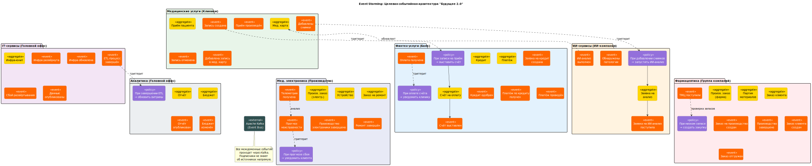

# Задание 4. Моделирование домена и интеграций

## Задача 1. Домены и контексты

## Бизнес-области и основные контексты

### Медицинские услуги (сеть клиник)

#### Контекст: управление приёмами пациентов

##### Агрегаты
* приём пациента

##### События
* создание записи на приём;  
* перенос записи;  
* отмена записи;  
* отметка “приём произведён”;

#### Контекст: управление медицинской картой пациента

##### Агрегаты
* медицинская карта пациента со всеми записями

События
* добавление записи в медицинской карте;  
* добавление диагностических снимков.

#### Контекст: управление персоналом

##### Агрегаты:
* расписание врача  
* личное дело врача

### Финтех-услуги (банк)

#### Контекст: кредитование частных лиц и организаций

Сейчас – кредитование пациентов. В будущем может открыться кредитование корпоративных клиентов при покупке техники в кредит.

##### Агрегаты
* кредит (от заявки до погашения)

События:
* создание заявки на кредит;  
* обновление статуса заявки на кредит;  
* одобрение заявки на кредит;  
* получение платежа по кредиту.

#### Контекст: банковское обслуживание подразделений концерна

Сюда может входить:
- отправка счетов на оплату плательщикам (NB: параметры счёта мы получаем извне, банк может не знать, сколько стоит, например, лечение зубов, это ему заполнят в клинике),  
- отслеживание оплаты и уведомление о поступлении средств,  
- ведение текущих счетов подразделений концерна,  
- оперативное кредитование подразделений концерна для покрытия кассовых разрывов.

##### Агрегаты
- исходящий счёт на оплату для платежей от корпоративных клиентов (с прилагающимися актами или накладными);  
- чек об оплате для платежей от физлиц;  
- исходящий платёж;  
- входящий счёт на оплату.

##### События
- счёт создан и отправлен плательщику;  
- поступила оплата по счёту;  
- счёт отменён или истёк срок оплаты;  
- накладная / акт подписаны;  
- создан исходящий платёж;  
- исходящий платёж проведён;  
- исходящий платёж отменён.

### ИИ-сервисы (ИИ-компания)

Считаем, что ИИ-компания специализируется на ИИ-сервисах для работы с медицинскими данными. И что она предоставляет их не только для клиник “Будущего 2.0”, а и для многих сторонних организаций.

#### Контекст: обработка входящих медицинских данных

Получаем снимки, томограммы, ЭКГ, результаты анализов – и обрабатываем их моделями ИИ. Эти снимки мы можем получать либо через веб-портал ИИ-компании через ЛК партнёра, либо через интеграцию с различными МИС.

##### Агрегаты

- Заявка на анализ данных

##### События

- заявка поступила;  
- заявка выполнена;  
- сбой при выполнения заявки;  
- обнаружены патологии.

### IT-сервисы для подразделений концерна (головной офис)

#### Контекст: платформа данных для подразделений концерна

Здесь мы централизованно предоставляем набор “сервисов самообслуживания” для работы с данными для остальных подразделений, поддерживаем сбор и хранение данных из всех источников (как из подразделений “Будущего 2.0”, так и извне), а также поддерживаем инфраструктуру для передачи событий.

#### Контекст: облачный хостинг для подразделений концерна

Если разработчикам из подразделений нужен отдельный хостинг для разработки (хоть просто парочка виртуалок с нужными параметрами, хоть kubernetes-кластер) – они создают репозиторий с terraform-спецификацией, кладут его в Git-репозиторий, и специальный пайплайн развернёт им инфру и пришлёт ключи от неё. Если нужно изменить параметры хостинга, то они коммитят изменения в Git, и пайплайн их подхватит.

Это то, чему мы учились в задании 2 = )

##### Агрегаты

* Infrastructure Unit: то, что управляется отдельной terraform-конфигурацией, будь то отдельная виртуалка / набор виртуалок / kubernetes-кластер).

##### События

* заявка на развёртывание / обновление получена;  
* развёртывание / обновление завершено успешно;  
* развёртывание / обновление завершено сбоем;  
* liveness probe failed.

### Аналитика и планирование (головной офис)

#### Контекст: анализ эффективности подразделений концерна

Анализ бизнес-эффективности подразделений, анализ эффективности инвестиций и конкретных проектов. Финансовая отчётность для акционеров.

##### Агрегаты

Квартальный отчёт для акционеров

##### События

Публикация квартального отчёта

#### Контекст: перспективное планирование

Проработка стратегии развития и плана капитальных расходов на следующие несколько лет.

##### Аграгаты

* Корпоративный бюджет

##### События

* Добавлена статья бюджета  
* Изменена статья бюджета

### Производство лекарств (группа фармацевтических компаний)

#### Контекст: управление производством лекарственных препаратов

Здесь может быть несколько подконтекстов:

- управление персоналом;  
- управление закупками;  
- исполнение производства.

##### Агрегаты

* Личное дело сотрудника  
* Заявка на закупку ТМЦ  
* Запись ТМЦ  
* Производственный заказ (на него ссылаются конкретные опарации)  
* Партия материалов (в т.ч. готовой продукции).

##### События

* Создание заявки на закупку  
* Обновление заявки на закупку  
* Выполнение заявки на закупку  
* Поступление ТМЦ  
* Списание ТМЦ  
* Поступление сотрудника  
* Увольнение сотрудника  
* Обновление в личном деле сотрудника  
* Создание заказа на производство  
* Обновление статуса заказа  
* Выполнение производственной операции  
* Выполнение заказа  
* Получение материала.  
* Расход материала.  
* Списание материала (по некондиции или истечению сроков годности).

#### Контекст: управление продажами

Сюда входит управление поступившими заказами, логистикой и складскими запасами. Здесь мы собираем всю информацию о действующих корпоративных клиентах.

##### Агрегаты

* Заказ клиента  
* Претензия клиента

##### События

* Создание заказа  
* Изменение статуса заказа  
* Появление претензии

#### Контекст: промоционные мероприятия

Основная активность медпредов. Общение с врачами, выездные семинары, выступления в ЛПУ, общение в СМИ и иже с ним.

##### Агрегаты

* Промоционное мероприятии (описание отчёта + указан город, ЛПУ, врачи, списание средств, образцов, мерча и др.)

##### События

* Промоционное мероприятие запланировано  
* Промоционное мероприятие состоялось / отменилось

### Производство медицинской электроники

#### Контекст: управление производством электроники

##### Агрегаты

* Производственный заказ  
* Технологическая карта  
* Запасы ТМЦ

##### События

* Изменение статуса производственного заказа  
* Поступление / списание ТМЦ  
* Обновление технологической карты (в т.ч. регистрация новых операций)

#### Контекст: гарантийный и негарантийный ремонт

##### Основные события

* регистрация заказа на ремонт;  
* изменение статуса заказа (включая закрытие заказа);  
* комментарии по заказу.

#### Контекст: сбор и обработка телеметрии с оборудования

Некоторое оборудование умеет отправлять телеметрию производителю:

* чтобы производитель мог заранее прогнозировать неисправность (например, отследив повышенную вибрацию газодинамического подшипника в профессиональной лабораторной центрифуге и рост его температуры при работе);  
* чтобы производитель лучше понимал, в каких условиях работает его оборудование и на каких режимах (чтобы учесть при разработке новых моделей);  
* для формирования датасетов машинного обучения.

##### Агрегаты

* Устройство (единица оборудования)  
* Версии встроенного ПО для устройств

##### События

* Регистрация телеметрического события по устройству  
* Появление новой версии ПО

#### Контекст: продажи медицинской электроники

Продажи могут быть как дистрибьюторам, так и конкретным ЛПУ или другим производителям по OEM-контрактам.

## Задача 2. Целевая событийная архитектура и Event Storming-диаграмма

### Event Storming-диаграмма



*Исходный файл PlantUML: [event_storming_diagram.puml](event_storming_diagram.puml)*

**Легенда:**
- 🟠 **Оранжевый** — События (Domain Events): факты, произошедшие в системе
- 🟡 **Жёлтый** — Агрегаты: сущности, над которыми выполняются действия
- 🟣 **Фиолетовый** — Политики: правила вида «Если событие A → выполнить команду B»
- ⬜ **Серый** — Внешние системы (Kafka как Event Bus)

### Основные потоки событий между доменами

| Источник | Событие | Подписчики | Описание |
|----------|---------|------------|----------|
| Клиники | `Запись создана` | Банк | Триггерит политику выставления счёта на оплату |
| Клиники | `Добавлены снимки` | ИИ-компания | Запускает автоматический ИИ-анализ |
| Банк | `Оплата получена` | Клиники, Фарма, Электроника | Уведомление об оплате для обновления статусов |
| Банк | `Кредит одобрен` | Клиники | Разблокировка записи на лечение в кредит |
| ИИ-компания | `ИИ-анализ выполнен` | Клиники | Обновление медицинской карты пациента |
| ИИ-компания | `Обнаружены патологии` | Клиники | Срочное уведомление врача |
| Платформа | `ETL-процесс завершён` | Аналитика | Обновление аналитических витрин |
| Платформа | `Данные опубликованы` | Все подразделения | Уведомление о доступности новых данных |
| Электроника | `Телеметрия получена` | Платформа, ИИ-компания | Сбор данных для анализа и прогнозов |
| Электроника | `Прогноз неисправности` | Сервисная служба | Проактивное уведомление клиента |
| Фарма | `ТМЦ поступили` | Производство | Триггер проверки запасов и закупок |
| Фарма | `Заказ отгружен` | Банк | Инициация расчётов с клиентом |

### Шина событий

Все междоменные события проходят через **Apache Kafka**:
- Каждый домен публикует события в свои топики (например, `clinics.appointments`, `bank.payments`)
- Подписчики не знают об источниках напрямую — только о схемах событий
- Схемы событий регистрируются в **Karapace** (Schema Registry)
- Для гранулярного доступа (например, «только платежи по счёту X») используются **Redis Streams**

## Задача 3. Обосновать применение событийного подхода

### Почему EDA выгоднее текущей архитектуры (Camel + DWH)?

#### Проблемы текущей архитектуры

| Проблема | Camel | DWH (MS SQL) |
|----------|-------|--------------|
| **Централизованная настройка** | Любое изменение интеграции требует правки конфигов Camel и участия DevOps | — |
| **Tight coupling** | Camel знает и об источниках, и о получателях данных | Все системы зависят от структуры DWH |
| **Масштабируемость** | Ограничена общей базой состояния | Дорогие лицензии MS SQL, лимиты кэша |
| **Задержки** | Каждое сообщение конвертируется в Exchange-объект | Batch-ETL с задержками в часы |
| **Гибкость** | Добавление нового потребителя = изменение центрального конфига | Новый отчёт = согласование с командой DWH |

#### Преимущества событийного подхода (EDA)

**1. Слабая связанность (Loose Coupling)**
- Источник событий не знает, кто его слушает
- Новый подписчик подключается самостоятельно, без изменений в источнике
- Каждое подразделение может развиваться независимо

**2. Масштабируемость**
- Kafka горизонтально масштабируется по партициям
- Каждый потребитель читает в своём темпе (consumer groups)
- Нет узкого места в виде централизованной шины

**3. Скорость реакции (Real-time)**
- События доставляются за миллисекунды вместо часов batch-ETL
- Критично для: уведомлений об оплате, прогнозов неисправностей, алертов ИИ

**4. Self-service интеграция**
- Подразделения сами подписываются на нужные топики
- Схемы событий публикуются в каталоге данных (DataHub)
- Минимум согласований с платформенной командой

**5. Аудит и воспроизводимость**
- Kafka хранит историю событий (retention)
- Можно «перемотать» и переобработать события
- Полный audit trail для compliance

### Где EDA оправдана, а где — нет?

#### ✅ EDA оправдана

| Сценарий | Почему |
|----------|--------|
| **Междоменная интеграция** | Разные команды, разные релизные циклы. Слабая связанность критична. |
| **Уведомления в реальном времени** | Оплата получена → клиника видит сразу. Прогноз поломки → клиент уведомлён. |
| **Телеметрия с устройств** | Высокий объём данных, много источников, асинхронная обработка. |
| **Аналитические пайплайны** | События → Kafka → Spark Streaming → витрины в реальном времени. |
| **Интеграция с внешними партнёрами** | ИИ-компания обслуживает не только «Будущее 2.0». События как универсальный контракт. |

#### ⚠️ EDA избыточна / не подходит

| Сценарий | Почему | Альтернатива |
|----------|--------|--------------|
| **Внутридоменные операции** | Внутри одного bounded context проще синхронные вызовы. | REST/gRPC между сервисами одной команды |
| **Строгие транзакции** | Eventual consistency не подходит для критичных финансовых операций. | Синхронный API банка для проведения платежей |
| **Простые CRUD-операции** | Накладные расходы на Kafka не оправданы для редких операций. | Прямые вызовы API |
| **Batch-аналитика раз в сутки** | Если real-time не нужен, проще Airflow + batch ETL. | Airflow DAG-и |

### Сравнение архитектур

```
                    ТЕКУЩАЯ                         ЦЕЛЕВАЯ (EDA)
                    ========                        =============

     ┌─────────┐                           ┌─────────┐
     │ Клиника │──┐                        │ Клиника │──► Kafka ──► Подписчики
     └─────────┘  │                        └─────────┘      │
                  │    ┌───────┐                            │
     ┌─────────┐  ├───►│ Camel │───► DWH      ┌─────────┐   │
     │  Банк   │──┤    └───────┘              │  Банк   │──►┘
     └─────────┘  │         │                 └─────────┘
                  │         ▼                      ▲
     ┌─────────┐  │    ┌─────────┐            ┌───┴───┐
     │   ИИ   │──┘    │ Отчёты  │            │ Kafka │◄── Все домены
     └─────────┘      └─────────┘            └───────┘
                                                  │
    Проблемы:                                     ▼
    - Каждое изменение = правка Camel      ┌───────────┐
    - Batch-задержки до часов              │ DataHub   │ (каталог событий)
    - Дорогой MS SQL                       └───────────┘

                                           Преимущества:
                                           - Self-service подписка
                                           - Real-time доставка
                                           - Независимое масштабирование
```

### Итоговая рекомендация

**Внедрять EDA поэтапно:**

1. **Фаза 1**: Междоменные интеграции (клиники ↔ банк, клиники ↔ ИИ)
2. **Фаза 2**: Телеметрия с оборудования → Kafka → аналитика
3. **Фаза 3**: Real-time аналитические витрины
4. **Не трогать**: внутридоменные синхронные операции, критичные финансовые транзакции

Событийный подход даст «Будущему 2.0» гибкость при подключении новых подразделений (фарма, электроника), ускорит интеграцию и снизит нагрузку на платформенную команду за счёт self-service модели.